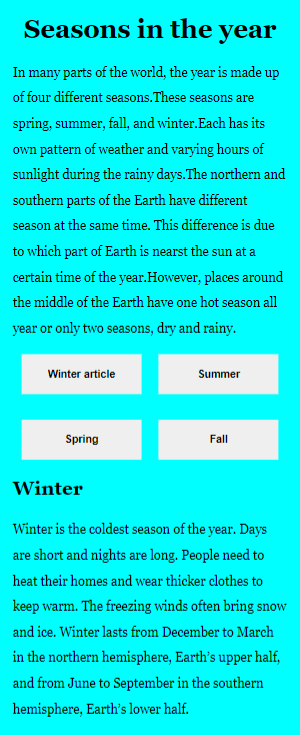
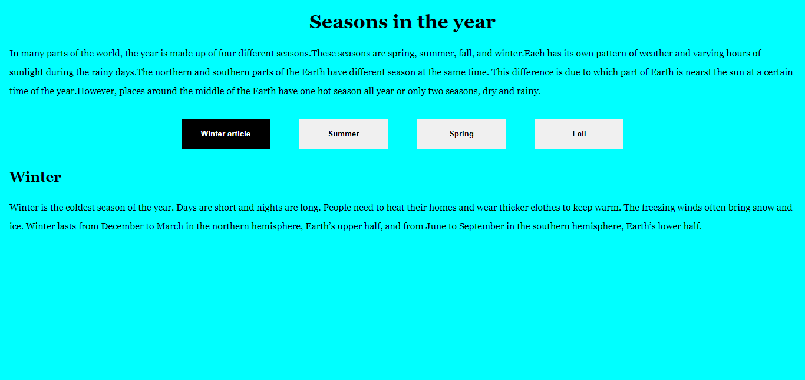

# 30 days of React. Day 08 Conditional Rendering
## SeasonS of the year
## Table of contents

- [Overview](#overview)
  - [The challenge](#the-challenge)
  - [Screenshot](#screenshot)
  - [Links](#links)
- [My process](#my-process)
  - [Built with](#built-with)
  - [What I learned](#what-i-learned)
- [Author](#author)


## Overview

### The challenge
Make a single page application which changes the body of the background based on the season of the year(Autumn, Winter, Spring, Summer)
### Screenshot





### Links

- Solution URL: (https://github.com/ibimina/year-seasons)
- Live Site URL:(https://ibimina.github.io/year-seasons/)

## My process
- import react from React,Component
- created a function that generate a random number used to change the state of data
- Created a Header,Main,Button component
- import css to be used for the project

Functions used to change the state of aseason  when winter button is click
```jsx
 winterSeason = () => {
    this.setState({ winter: !this.state.winter });
    this.setState({ summer: false });
    this.setState({ spring: false });
      this.setState({ fall: false });
  };
```


### Built with

- JSX
- CSS custom properties
- Grid
- Mobile-first workflow


### What I learned

- I learnt Conditional Rendering using If and Else statement and Ternary Operator

## Author

- Ibimina Hart
- Frontendmentor -(https://www.frontendmentor.io/ibimina)
- Twitter -(https://www.twitter.com/ibiminaaH)
